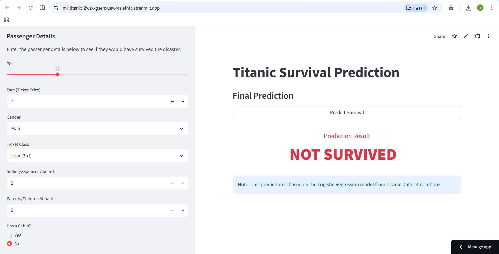

# Titanic Survival Prediction - Machine Learning

A machine learning project that predicts passenger survival based on demographic data using Logistic Regression.
---


---
### Key Features

Highlight what makes the project useful or interesting.
- Interactive UI (using tools like Streamlit).
- Data preprocessing and cleaning scripts.
---

###Tech Stack
List the languages, libraries, and tools you used.
- Language: Python
- Libraries: Pandas, NumPy, Seaborn , Matplotlib, Scikit-Learn
- Deployment: Streamlit
---

### Installation & Setup
Provide step-by-step instructions so others can run your code locally.
```
# Clone the repository
git clone https://github.com/user/repo-name.git

# Install dependencies
pip install -r requirements.txt

# Run the app
streamlit run app.py
```
